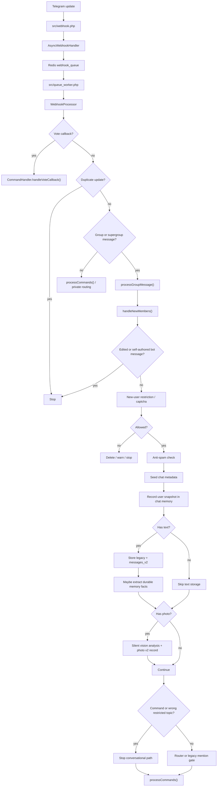
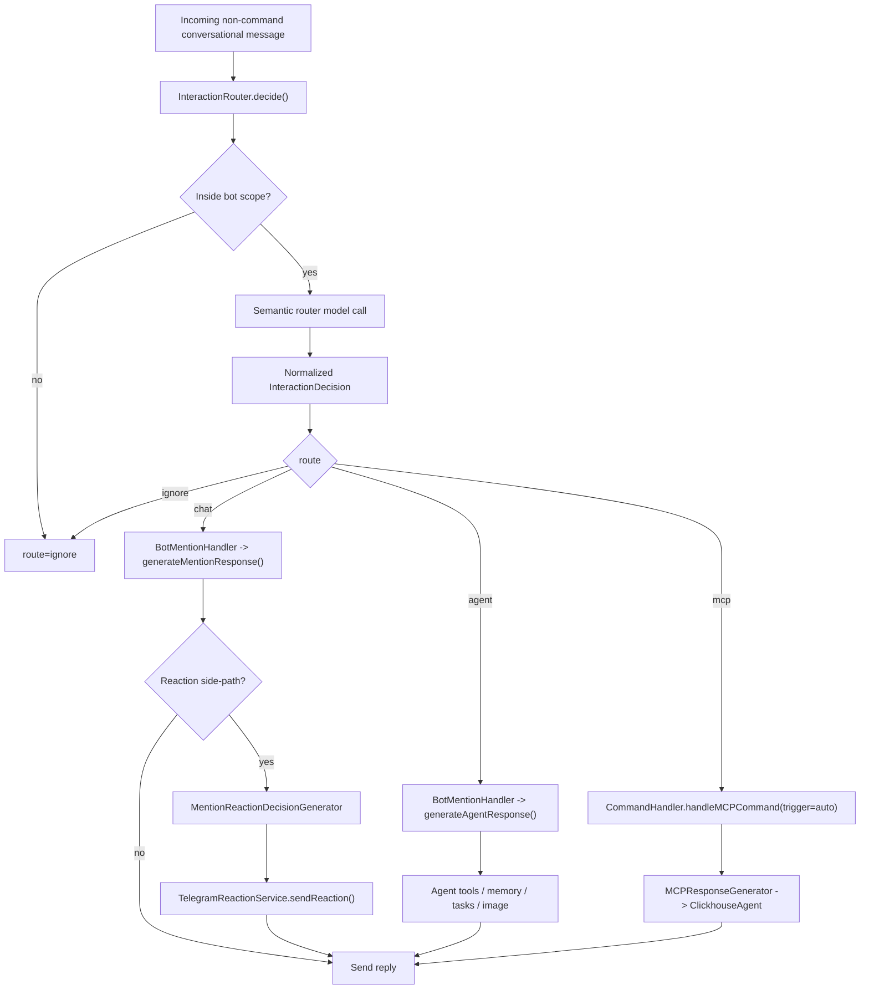
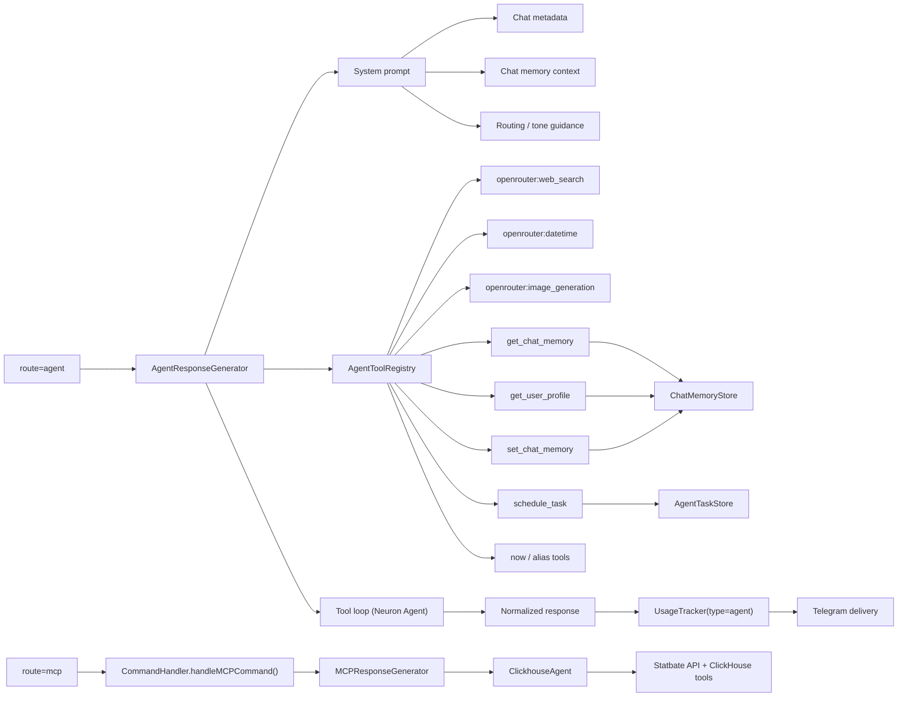
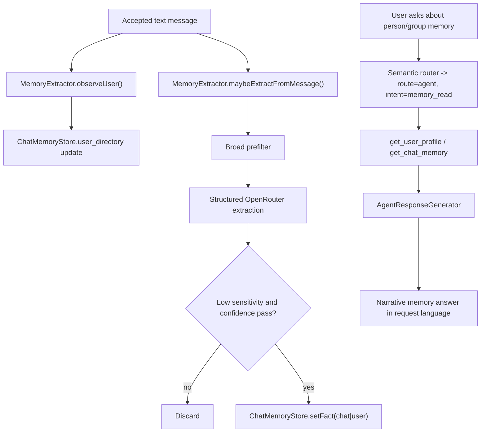
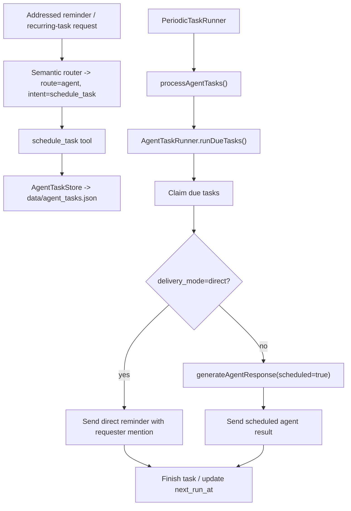

# Lolbot Summary

## Project Purpose

This repository runs a Telegram operations bot for group chats. "Summary bot" is only one part of the project.

Actual responsibilities:

1. Summarize busy Telegram chats with message links and user stats.
2. Answer Statbate and ClickHouse analytics questions through `/mcp`.
3. Handle conversational replies, reactions, image understanding, and explicit image generation/editing.
4. Enforce group moderation flows such as vote-based bans/mutes and new-user restrictions.
5. Expose lightweight internal web pages for usage analytics, stored messages, and long MCP responses.

The right mental model is:

```text
Telegram group bot
  + summary generator
  + analytics agent
  + conversational bot
  + reaction bot
  + image-aware bot
  + moderation helper
  + tiny internal dashboard/viewer
```

## Runtime and Production Shape

### Containers

- `bot`
  - Runs FrankenPHP + Caddy.
  - Exposes `src/webhook.php` and the internal web routes.
  - Runs cron inside the same container.
- `queue-worker`
  - Runs `php /app/src/queue_worker.php`.
  - Consumes webhook updates from Redis.
  - Runs `PeriodicTaskRunner`.
- `redis`
  - Async transport queue for webhook payloads.

### Production host

- Server: `195.3.220.43`
- App path: `/home/summary`
- Public domain: `sum.statbate.com`
- Telegram webhook: `https://sum.statbate.com/src/webhook.php`

Important production nuance:

- `/home/summary` is not a git checkout.
- `docker-compose.yml` bind-mounts `src/`, `config/`, `composer.json`, `composer.lock`, `Caddyfile`, and `data/`.
- Production deploys are file-sync based, then container restart based.

### External dependencies

- Telegram Bot API
- OpenRouter
- ClickHouse
- Statbate Plus API
- Redis
- Inspector / Neuron observability

## Entry Points

### Telegram webhook path

```text
Telegram
  -> /src/webhook.php
  -> App\Bot::processWebhook()
  -> AsyncWebhookHandler
  -> Redis queue (webhook_queue)
  -> src/queue_worker.php
  -> App\Bot::processWebhookAsync()
  -> App\Services\WebhookProcessor
```

### Scheduled path

```text
cron hourly
  -> src/cron_job.php
  -> App\Bot::checkAndSendDailySummaries()
  -> App\Bot::sendDailySummaries()
  -> CommandHandler::handleSummaryCommand()
```

### Web path

```text
Caddy
  /dashboard         -> src/dashboard.php
  /messages          -> src/messages.php
  /r/{id}            -> src/view.php
  /r/{id}/og.png     -> src/og-image.php
  /src/webhook.php   -> Telegram webhook endpoint
```

## Request Handling Overview

`App\Services\WebhookProcessor` is the main orchestration layer for Telegram updates.

Current group-message flow:

```text
incoming update
  -> duplicate guard
  -> new member handling
  -> ignore self-authored bot messages
  -> ignore edited messages
  -> new-user restriction / captcha / wait-time checks
  -> anti-spam handler (AI path currently disabled)
  -> seed chat metadata cache
  -> observe sender into chat memory user_directory
  -> store plain text message to legacy + v2 history
  -> maybe extract durable memory facts from accepted text
  -> analyze photo silently when present
  -> if accepted safe message from unknown user: increment known-user candidate state
  -> if command or wrong topic: stop conversational path, dispatch command later
  -> detect reply-to-bot
  -> if router enabled:
       -> InteractionRouter::decide()
       -> ignore | chat | agent | mcp
     else:
       -> legacy mention path
  -> command dispatch
```

## Router and Conversational Flow

### New router

The new additive router is implemented in:

- `src/Services/InteractionRouter.php`
- `src/Services/InteractionDecision.php`

It is intentionally conservative on the outside, but the actual route choice is semantic and model-driven.

Global switch:

- config key: `intent_router_enabled`
- env source: `INTENT_ROUTER_ENABLED`
- default: `true`

Per-chat override:

- setting key: `intent_router_enabled`
- values: `null | true | false`
- `null` means "use global default"

Related agent-tools switch:

- config key: `agent_tools_enabled`
- env source: `AGENT_TOOLS_ENABLED`
- default: `true`
- per-chat override setting: `agent_tools_enabled`

### Router outputs

`InteractionDecision` contains:

- `route`
  - `ignore`
  - `chat`
  - `mcp`
  - `agent`
- `tone`
  - `neutral`
  - `witty`
- `intent`
  - examples: `analytics`, `question`, `capabilities`, `image`, `banter`, `schedule_task`, `memory_read`, `memory_write`, `web_search`, `datetime`
- `confidence`
- `addressed_to_bot`
- `analytics_confidence`
- `image_intent`
  - `none`
  - `analyze_only`
  - `generate_or_edit`
- `cleaned_prompt`
- `reason`

### Router decision schema

```text
message
  -> outside addressed-to-bot and bot-topic scope?
       yes -> route=ignore
       no  -> continue

  -> semantic router prompt
       inputs:
         original_message
         cleaned_guess
         addressed_to_bot
         reply_to_bot
         has_photo
         bot_topic_context
         agent_enabled
         bot capabilities + command hints

  -> model returns structured JSON
       route=ignore | chat | mcp | agent
       tone=neutral | witty
       intent=analytics | memory_read | schedule_task | web_search | image | ...
       analytics_confidence
       image_intent
       cleaned_prompt

  -> normalize
       if route=agent and agent_enabled=false -> downgrade to chat
       if route=mcp -> force tone=neutral and analytics_confidence>=75
       if semantic call fails -> conservative fallback
```

### Addressing rules

The router considers a message addressed to the bot when:

- it is a reply to the bot, or
- it contains one of the known aliases from `BotIdentityContext`

Current aliases:

- `Apollo`
- `Apolon`
- `Аполон`
- `Аполлон`
- `bot`
- `бот`
- `ботик`
- `железяка`
- telegram username, with and without `@`, when available at runtime

### Auto-MCP behavior

Auto-MCP only happens when the router is enabled and the message is addressed to the bot.

Thresholds:

- `>= 75`
  - route directly to `/mcp` logic
- `50-74`
  - stay in normal chat path
  - answer neutrally
  - suggest `/mcp`
- `< 50`
  - no analytics routing

Important compatibility note:

- explicit `/mcp` always wins and bypasses the router

### Agent routing behavior

When `agent_tools_enabled` is on for the chat, semantic routing can choose `route=agent` for:

- reminders and scheduled jobs
- task list/status questions
- "what do you know/remember" memory questions
- participant profile lookup
- web search / latest docs / latest news
- date and time questions
- explicit image generation or editing requests

This is a true tool path, not a fancy chat reply.

### Legacy behavior when router is off

When `intent_router_enabled` is off:

- plain non-command text in the allowed topic still enters `BotMentionHandler`
- `MentionResponseGenerator` still runs its "should I reply?" confidence gate for non-replies-to-bot
- replies to the bot still always generate a response
- photos no longer auto-trigger replies unless addressed or replied-to

So:

```text
router OFF
  -> plain text still reaches mention pipeline
  -> photo-only message does NOT auto-reply unless addressed/reply-to-bot

router ON
  -> router becomes the explicit conversational gate
  -> routes into chat | agent | mcp | ignore
```

## Tone, Self-Awareness, and Bot Identity

### Shared identity

`src/Services/BotIdentityContext.php` is the shared source of:

- canonical bot name
- aliases
- capability list
- command help snippets

This context is injected into prompts so the normal chat path and analytics path are no longer unaware of each other.

### Reply style control

Per-chat setting:

- `reply_style_mode`
- values: `auto | neutral | witty`
- default: `auto`

Admin commands:

- `/settings style auto`
- `/settings style neutral`
- `/settings style witty`

Behavior:

- `auto`
  - router-selected tone wins
- `neutral`
  - force serious/helpful replies
- `witty`
  - force playful/sarcastic replies

### Prompt behavior

`PromptBuilder` now tells the chat model:

- do not turn normal questions into jokes
- explain real commands/capabilities when asked
- use wit mainly for banter
- stay direct for factual/help/analytics questions

## Photo and Image Handling

### Photo-safe upgrade

Current photo behavior is intentionally split into two stages:

1. silent image analysis
2. optional conversational or generation behavior

The key rule is:

```text
photo present != permission to reply
photo present != permission to generate/redraw
```

### Incoming photo flow

```text
Telegram photo
  -> download from Telegram file endpoint
  -> describe with vision model
  -> store structured v2 sidecar record
  -> if not addressed to bot and not reply-to-bot:
       stop here
  -> else:
       pass passive image summary into chat context
```

### Explicit image generation only

`ImageProcessor::isImageGenerationRequest()` now requires explicit create/edit intent patterns such as:

- draw / generate / create / make image
- redraw / edit / transform / restyle / upscale
- Russian equivalents like `нарисуй`, `сгенерируй`, `перерисуй`

Important safety behavior:

- AI-generated image descriptions are not reused as generation prompts
- passive vision text is only prompt context
- any plain uploaded photo in chat does not automatically trigger redraw/generation

### Image intent values

The router exposes:

- `none`
- `analyze_only`
- `generate_or_edit`

That intent is logged and passed through usage context.

## Slash Commands

### Main commands

- `/summary [window]`
- `/mcp [query]`
- `/settings ...`
- `/help`
- `/account [token]`
- `/voteban`
- `/votemute`
- `/votekick`
- `/yes`
- `/no`

### `/summary`

Handled by `CommandHandler::handleSummaryCommand()`.

Current behavior:

- group-focused; positive chat IDs are skipped
- uses `MessageStorage`
- requires at least 5 messages in the window
- supports:
  - `Nh`, `Nm`, `Nd`
  - `today`
  - `yesterday`
  - `YYYY-MM-DD`
  - `HH:MM-HH:MM`
- caps windows to 7 days
- uses structured summary JSON from `SummaryGenerator`
- outputs Telegram HTML
- wraps result in expandable blockquote and tags with `#dailySummary`
- attempts to pin the summary

### `/mcp`

Handled by `CommandHandler::handleMCPCommand()`.

Current flow:

```text
/mcp query
  -> typing action
  -> build MCP context
       bot identity
       + chat metadata
       + recent Telegram context
  -> AIService::generateMCPResponse()
  -> MCPResponseGenerator
  -> ClickhouseAgent
  -> TelegramSender::sendHtmlAsMarkdownMessage()
```

Important details:

- MCP history is persistent under `data/chat_history/`
- history key:
  - `{chatId}`
  - `{chatId}_{threadId}` for forum topics
- history window: 30k tokens
- non-subscribed users are limited to about 30 days of data
- `/account` stores a Statbate Plus token per Telegram user ID and lifts that limit

### `/settings`

Admin-only in groups.

Backed by one JSON file per chat:

- `data/{chatId}_settings.json`

Current settings:

- `language`
- `summary_enabled`
- `summary_hour_utc`
- `bot_mentions_enabled`
- `reply_style_mode`
- `group_context_note`
- `intent_router_enabled`
- `agent_tools_enabled`
- `vote_moderation_enabled`
- `vote_threshold_ban`
- `vote_threshold_mute`
- `vote_duration_sec`
- `vote_mute_duration_sec`
- `new_user_restriction_enabled`
- `message_thread_id`

Current admin commands:

- `/settings`
- `/settings help`
- `/settings language [en|ru]`
- `/settings summary [on|off]`
- `/settings mentions [on|off]`
- `/settings style [auto|neutral|witty]`
- `/settings router [on|off]`
- `/settings agent [on|off]`
- `/settings context [text]`
- `/settings context clear`
- `/settings voting [on|off]`
- `/settings voteban [n]`
- `/settings votemute [n]`
- `/settings voteduration [duration]`
- `/settings muteduration [duration]`
- `/settings newuser [on|off]`
- `/settings time [0-23]`
- `/settings topic here`
- `/settings topic clear`
- `/settings topic <id>`

### `/help`

Shows:

- summary window syntax
- command overview
- router/tone notes
- moderation commands

### `/account`

Private chat only.

Purpose:

- save and verify a Statbate Plus token for a Telegram user

Important storage nuance:

- this is stored through `SettingsService`
- key space is the Telegram user ID, not a group chat ID

## Moderation and Safety

### Vote moderation

Files:

- `src/Services/VoteService.php`
- `src/Services/MuteService.php`
- `src/Services/PeriodicTaskRunner.php`

State:

- `data/votes.json`
- `data/mutes.json`

Behavior:

- vote commands must reply to a target message
- admins cannot be targeted
- vote starter auto-casts the first YES
- inline buttons are used
- `/yes` and `/no` text replies also work
- successful ban/mute deletes the offending message
- vote expiry/finalization is worker-driven

### New-user restriction

Handled by `NewUserRestrictionService`.

State file:

- `data/new_user_restrictions.json`

Behavior:

- controlled by `/settings newuser on|off`
- new members get a math captcha
- they can solve it or wait 10 minutes
- restricted messages are deleted
- captcha/warning/success messages are scheduled for cleanup
- users with prior history can be auto-marked verified

### Anti-spam classifier reality check

`AntiSpamHandler` exists, but its real AI classifier path is still effectively disabled.

Do not assume "AI antispam" is active.

Today, the practical built-in protection is:

- new-user restriction
- manual/community vote moderation

## Data and Persistence

The bot is mostly file-backed. Redis is only the async queue.

### Legacy and new history files

Legacy history remains unchanged:

- `data/{chatId}_messages.json`

New additive sidecar:

- `data/{chatId}_messages_v2.jsonl`

Important compatibility contract:

- no migration required
- old history stays readable forever
- new writes keep legacy flat storage
- new writes also append structured v2 records
- readers prefer richer v2 data when present and merge with legacy lines

### Legacy message line schema

```text
[12:34] [ID:123] username: text
[12:34] [ID:123] [TID:456] username: text
[12:34] [ID:123] [BOT] botname: text
```

### Structured message schema

`StructuredMessageRecord` writes JSONL records shaped like:

```text
{
  "ts": 1712212345,
  "chat_id": -1001234567890,
  "thread_id": 456,
  "message_id": 123,
  "user_id": 987654321,
  "username": "alice",
  "first_name": "Alice",
  "last_name": "Smith",
  "display_name": "Alice Smith (@alice)",
  "is_bot": false,
  "message_type": "text|photo",
  "text": "hello",
  "caption": null,
  "has_photo": false,
  "image_summary": null,
  "legacy_username": "Alice Smith (@alice)"
}
```

Display-name policy:

```text
first_name + last_name + (@username) if available
else @username
else legacy sender string
```

### Durable user trust and memory files

Additional additive state now used in production:

- `data/known_users.json`
  - durable per-chat known/candidate users for anti-spam and captcha bypass logic
- `data/agent_tasks.json`
  - file-backed reminders and recurring agent jobs
- `data/chat_memory/{chatId}.json`
  - shared group facts
  - per-user profile facts
  - user directory snapshots

Chat memory file shape is roughly:

```text
{
  "chat_facts": [...],
  "user_facts": {
    "12345": [...]
  },
  "user_directory": {
    "12345": {
      "user_id": 12345,
      "username": "alice",
      "display_name": "Alice Smith (@alice)",
      "first_seen_at": 1712000000,
      "last_seen_at": 1712100000
    }
  },
  "updated_at": 1712100000
}
```

### Chat metadata cache

Additive file:

- `data/{chatId}_chat_meta.json`

Fields:

- `chat_id`
- `title`
- `username`
- `type`
- `description`
- `pinned_message_excerpt`
- `last_fetched_at`

Refresh behavior:

- seeded from incoming message chat data
- refreshed with `getChat`
- TTL: 6 hours

Prompt order:

```text
Telegram chat metadata
  -> admin-provided group context note
  -> recent message context
```

### Other important files

- `data/{chatId}_last_summary.txt`
- `data/chat_history/mcp_{historyKey}.chat`
- `data/previous_updates.json`
- `data/responses/{id}.md`
- `data/responses/og/{id}.png`
- `data/usage/YYYY-MM-DD.jsonl`
- `data/webhook_YYYY-MM-DD.log`
- `data/error_YYYY-MM-DD.log`
- `data/queue_worker_YYYY-MM-DD.log`
- `data/caddy-access.log`

## Message and Request Schemas

### Group message handling

```text
group message
  -> self-authored bot message?
       yes -> ignore entirely
       no  -> continue

  -> new-user restriction / captcha / waiting logic
       blocked -> delete or warn, stop
       allowed -> continue

  -> text?
       yes -> anti-spam check
            -> observe sender snapshot into user_directory
            -> store legacy + v2
            -> maybe memory extraction
       no  -> continue

  -> photo?
       yes -> analyze image, store v2 photo record
       no  -> continue

  -> explicit command or wrong restricted topic?
       yes -> stop conversational path, then dispatch command path if needed
       no  -> continue

  -> router enabled?
       yes -> decide(ignore|chat|agent|mcp)
       no  -> legacy mention gate
```

### Full message-processing schema

```text
Telegram update
  -> webhook.php
  -> AsyncWebhookHandler
  -> Redis queue
  -> queue_worker.php
  -> WebhookProcessor

WebhookProcessor
  -> callback vote?
       yes -> CommandHandler::handleVoteCallback()
       no  -> continue

  -> duplicate update?
       yes -> stop
       no  -> continue

  -> group/supergroup message?
       no  -> processCommands/private routing only
       yes -> processGroupMessage()

processGroupMessage()
  -> handleNewMembers()
  -> ignore edited/self-authored bot messages
  -> new-user restriction / captcha
  -> anti-spam
  -> metadata seed
  -> sender snapshot -> ChatMemoryStore::recordUserSnapshot()
  -> text store -> MessageStorage::storeMessage()
  -> memory extraction -> MemoryExtractor::maybeExtractFromMessage()
  -> passive photo analysis + v2 store
  -> router or legacy mention gate
  -> processCommands()
```

### Mermaid: end-to-end message flow



### Router schema

```text
InteractionRouter::decide()
  -> addressed/reply/bot-topic outer gate
  -> semantic router model call
  -> normalized InteractionDecision

InteractionDecision.route
  -> ignore
       -> stop
  -> mcp
       -> CommandHandler::handleMCPCommand(trigger=auto)
  -> chat
       -> BotMentionHandler
  -> agent
       -> BotMentionHandler
       -> AIService::generateAgentResponse()
```

### Mermaid: router and route fan-out



### Chat reply path

```text
BotMentionHandler
  -> load chat metadata context
  -> load memory context
  -> load recent chat context
  -> append routing guidance
  -> append passive image summary if present
  -> UsageTracker::setContext()

  -> route=chat
       -> AIService::generateMentionResponse()
            -> explicit image generation/edit?
                 yes -> ImageProcessor
                 no  -> MentionResponseGenerator
       -> maybe send Telegram reaction
       -> send text/photo reply
       -> store bot reply in legacy + v2 history

  -> route=agent
       -> AIService::generateAgentResponse()
       -> no reaction side-path
       -> send text/photo reply
       -> store bot reply in legacy + v2 history
```

### Agent/tool path

```text
generateAgentResponse()
  -> build system prompt
       bot identity
       + chat metadata
       + chat memory
       + routing/tone guidance
  -> AgentToolRegistry
       OpenRouter server tools:
         - openrouter:web_search
         - openrouter:datetime
         - openrouter:image_generation
       local tools:
         - get_chat_memory
         - get_user_profile
         - set_chat_memory
         - schedule_task
         - web_search alias
         - image_generation alias
         - now
  -> Neuron Agent tool loop (up to 6 tries)
  -> normalize response
  -> fallback repair if model missed schedule/memory tool usage
  -> UsageTracker(type=agent)
  -> Telegram delivery
```

### Mermaid: agentic tools, memory, and MCP boundaries



### Memory schema

```text
incoming accepted text message
  -> MemoryExtractor::observeUser()
       -> update user_directory snapshot

  -> MemoryExtractor::maybeExtractFromMessage()
       -> broad prefilter
       -> structured OpenRouter extraction
       -> low-sensitivity / confidence filter
       -> ChatMemoryStore::setFact(scope=chat|user)

addressed memory question
  -> semantic router -> route=agent, intent=memory_read
  -> get_user_profile / get_chat_memory tool
  -> AgentResponseGenerator
       -> rewrite stored facts into natural reply
       -> language follows current request, not raw stored fact language
```

### Mermaid: memory lifecycle



### Reactions schema

```text
route=chat only
  -> MentionReactionDecisionGenerator
  -> confidence / emoji / big-reaction decision
  -> TelegramReactionService::sendReaction()

route=agent or route=mcp
  -> no reaction side-path
```

### MCP / analytics path

```text
explicit /mcp
  -> CommandHandler::handleMCPCommand(trigger=slash)

router auto-MCP
  -> InteractionDecision.route=mcp
  -> CommandHandler::handleMCPCommand(trigger=auto)

handleMCPCommand()
  -> build MCP context
       bot identity
       + chat metadata
       + recent Telegram context
  -> MCPResponseGenerator
  -> ClickhouseAgent
       -> Statbate API tools
       -> ClickHouse query tools
       -> persistent thread history under data/chat_history/
  -> TelegramSender::sendHtmlAsMarkdownMessage()
  -> long response may be saved for /r/{id}
```

### Scheduled agent tasks

```text
user asks bot for reminder / recurring task
  -> semantic router -> route=agent, intent=schedule_task
  -> schedule_task tool
  -> AgentTaskStore writes data/agent_tasks.json

queue worker
  -> PeriodicTaskRunner::processAgentTasks()
  -> AgentTaskRunner::runDueTasks()
       -> claim due tasks
       -> direct reminder delivery OR scheduled agent execution
       -> mention requester for direct reminders
       -> finish task and update next_run_at / last_result_excerpt
```

### Mermaid: scheduled task lifecycle



## AI Models and Responsibilities

Configured model roles:

- `openrouter_summary_model`
  - structured summaries
- `openrouter_chat_model`
  - mention replies
  - semantic interaction router
  - agent tool loop
  - memory narrative rendering
  - mention should-respond gate in legacy path
- `openrouter_reaction_model`
  - reaction decisions
- `openrouter_vision_model`
  - image description
- `openrouter_image_model`
  - legacy image generation/editing fallback
- `openrouter_tool_model`
  - MCP / ClickHouse agent

Usage tracking goes to:

- `data/usage/YYYY-MM-DD.jsonl`

New additive usage fields include:

- `trigger`
- `route`
- `tone`
- `intent`
- `analytics_confidence`
- `image_intent`

## Web Surfaces

### `/dashboard`

- file: `src/dashboard.php`
- shows usage stats and estimated cost
- protected by simple token query param using `dashboard_token`

### `/messages`

- file: `src/messages.php`
- browses stored chat history for a specific `chat_id`
- also uses the dashboard token

### `/r/{id}`

- file: `src/view.php`
- renders long saved MCP responses as public shareable pages

### `/r/{id}/og.png`

- file: `src/og-image.php`
- generates social-preview images

## Scheduling and Retention

### Cron

- configured in `cron/telegram-bot-cron`
- runs hourly
- calls `php src/cron_job.php`

Cron does:

- daily-summary checks
- message cleanup before summaries

### Queue worker periodic tasks

`PeriodicTaskRunner` handles:

- vote expiry/finalization
- mute expiry/unmute
- new-user scheduled message deletions
- due agent reminders/tasks
- stale state cleanup
- log/response cleanup

### Retention

Current cleanup rules in practice:

- logs, chat history files, long response markdown: about 7 days
- usage analytics JSONL: about 30 days
- message history cleanup also prunes old stored messages

## Deployment Notes

### Production deploy shape

Since `/home/summary` is bind-mounted and not a git clone, real deploys are usually:

```text
sync changed files -> /home/summary
  -> if new PHP classes were added:
       composer dump-autoload inside live containers
  -> docker compose restart bot queue-worker
  -> inspect health and logs
```

Useful commands:

```bash
ssh root@195.3.220.43
cd /home/summary
docker compose restart bot queue-worker
docker logs summary-queue-worker-1 --tail 100
docker logs summary-bot-1 --tail 100
tail -f /home/summary/data/webhook_$(date +%Y-%m-%d).log
```

Webhook setup command:

```bash
php src/setup_webhook.php https://sum.statbate.com/src/webhook.php
```

## Important Files by Responsibility

### Entry points

- `src/webhook.php`
- `src/queue_worker.php`
- `src/cron_job.php`
- `src/setup_webhook.php`

### Core orchestration

- `src/Bot.php`
- `src/Services/WebhookProcessor.php`
- `src/Services/CommandHandler.php`

### Router and identity

- `src/Services/InteractionRouter.php`
- `src/Services/InteractionDecision.php`
- `src/Services/BotIdentityContext.php`
- `src/Services/ChatMetadataService.php`
- `src/Services/ChatMetadataSnapshot.php`

### AI layer

- `src/Services/AIService.php`
- `src/Services/AI/AIService.php`
- `src/Services/AI/MCPResponseGenerator.php`
- `src/Services/AI/SummaryGenerator.php`
- `src/Services/AI/MentionResponseGenerator.php`
- `src/Services/AI/MentionReactionDecisionGenerator.php`
- `src/Services/AI/ImageProcessor.php`
- `src/Services/AI/PromptBuilder.php`

### Analytics agent

- `src/Services/ClickhouseAgent.php`
- `src/Providers/OpenRouterAi.php`
- `src/Providers/OpenRouterMessageMapper.php`

### Storage and delivery

- `src/Services/MessageStorage.php`
- `src/Services/StructuredMessageRecord.php`
- `src/Services/SettingsService.php`
- `src/Services/QueueService.php`
- `src/Services/TelegramSender.php`
- `src/Services/TelegramReactionService.php`
- `src/Services/LoggerService.php`
- `src/Services/UsageTracker.php`

### Moderation and safety

- `src/Services/VoteService.php`
- `src/Services/MuteService.php`
- `src/Services/NewUserRestrictionService.php`
- `src/Services/AntiSpamHandler.php`
- `src/Services/PeriodicTaskRunner.php`

### Web UI

- `src/dashboard.php`
- `src/messages.php`
- `src/view.php`
- `src/og-image.php`
- `Caddyfile`

## Current Caveats

- Router is default-on globally unless `INTENT_ROUTER_ENABLED` disables it or a chat explicitly sets `/settings router off`.
- Legacy non-command text still reaches the mention pipeline when the router is off.
- Auto-MCP only exists when the router is enabled and the message is addressed to the bot.
- Reactions are additive and can happen alongside replies.
- Anti-spam classifier is still effectively disabled.
- Long `/mcp` results can be publicly viewed if someone has the `/r/{id}` URL.
- Runtime artifacts can dirty the tree:
  - `src/images/*`
  - `data/responses/*`
  - logs
  - usage files
- There is still an older nullable-type deprecation warning in `LoggerService::logError()` on startup logs.

## If You Modify X, Also Inspect Y

### Webhook or queue flow

- `src/webhook.php`
- `src/Services/AsyncWebhookHandler.php`
- `src/Services/QueueService.php`
- `src/queue_worker.php`
- `src/Services/WebhookProcessor.php`

### Summaries

- `src/Services/CommandHandler.php`
- `src/Services/MessageStorage.php`
- `src/Services/StructuredMessageRecord.php`
- `src/Services/AI/SummaryGenerator.php`
- `src/Services/AI/PromptBuilder.php`
- `src/Bot.php`
- `cron/telegram-bot-cron`

### `/mcp`

- `src/Services/CommandHandler.php`
- `src/Services/AI/MCPResponseGenerator.php`
- `src/Services/ClickhouseAgent.php`
- `src/Providers/OpenRouterAi.php`
- `src/Providers/OpenRouterMessageMapper.php`
- `src/Services/TelegramSender.php`
- `src/view.php`

### Mention/reply/router behavior

- `src/Services/WebhookProcessor.php`
- `src/Services/BotMentionHandler.php`
- `src/Services/InteractionRouter.php`
- `src/Services/BotIdentityContext.php`
- `src/Services/ChatMetadataService.php`
- `src/Services/AI/MentionResponseGenerator.php`
- `src/Services/AI/MentionReactionDecisionGenerator.php`
- `src/Services/AI/ImageProcessor.php`

### Settings or per-chat behavior

- `src/Services/CommandHandler.php`
- `src/Services/SettingsService.php`
- `data/{chatId}_settings.json`

### Photo handling or image generation

- `src/Services/WebhookProcessor.php`
- `src/Services/BotMentionHandler.php`
- `src/Services/AI/ImageProcessor.php`
- `src/Services/AI/PromptBuilder.php`
- `src/Services/MessageStorage.php`
